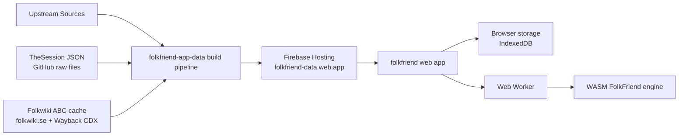
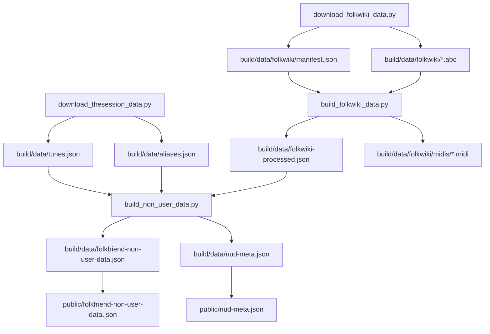
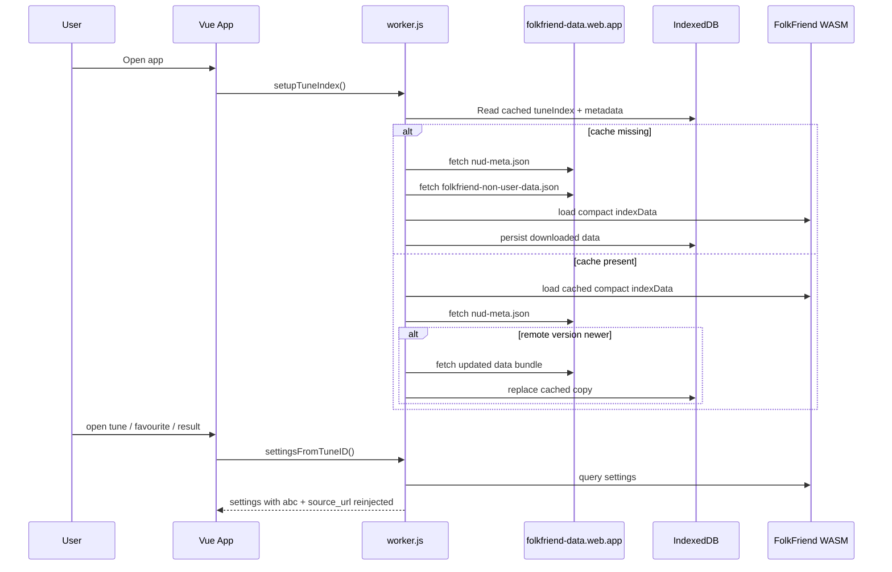
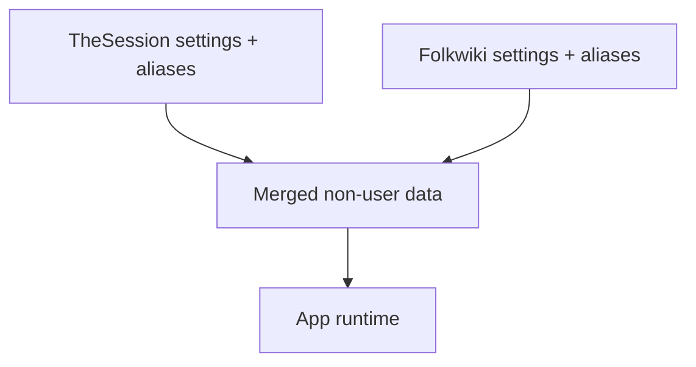

# FolkFriend System Architecture

This document describes the current FolkFriend proof-of-concept as a whole:

- where code lives
- where data is stored
- what runs locally during builds
- what runs in the browser at runtime
- how `folkfriend-app-data` connects to the `folkfriend` app

## Repositories

The system is currently split across two repositories:

1. `folkfriend`
   This contains the end-user web app, the Rust/WASM search engine, and the browser-side runtime logic.

2. `folkfriend-app-data`
   This contains the offline data build pipeline that downloads tune sources, transforms them, and publishes the static JSON data bundle consumed by the app.

## High-Level Topology



## Main Components

### 1. Data Build System

The offline data build happens in `folkfriend-app-data`.

Key files:

- `build/build.sh`
- `build/src/download_thesession_data.py`
- `build/src/download_folkwiki_data.py`
- `build/src/build_folkwiki_data.py`
- `build/src/build_non_user_data.py`
- `build/src/midi.py`

Responsibilities:

- download raw TheSession data
- discover and download Folkwiki ABC files
- convert ABC to MIDI contours via `abc2midi`
- merge sources into a single app-facing JSON bundle
- publish the resulting files to Firebase Hosting

### 2. Hosted Data Bundle

The generated artifacts are published from `folkfriend-app-data/public/`:

- `public/folkfriend-non-user-data.json`
- `public/nud-meta.json`

Production URLs:

- `https://folkfriend-data.web.app/folkfriend-non-user-data.json`
- `https://folkfriend-data.web.app/nud-meta.json`

These are large static files served over Firebase Hosting.

### 3. FolkFriend Web App

The web app lives in `folkfriend/app/`.

Important frontend/runtime files:

- `app/src/services/backend.js`
- `app/src/services/worker.js`
- `app/src/views/Tune.vue`
- `app/src/views/Favourites.vue`
- `app/src/js/source.mjs`

Responsibilities:

- boot the app UI
- fetch and cache the prebuilt tune index
- load the queryable index into WASM
- reinject heavy UI-only fields like ABC text and source URLs after lookup
- render tune detail, favourites, search, and result views

### 4. WASM Query Engine

The search engine lives in `folkfriend/rust/`.

Responsibilities:

- ingest the merged tune index as JSON
- build in-memory lookup structures
- perform contour and name queries
- return tune/settings/alias results to the worker

This code runs in the browser, inside WebAssembly, not on a server.

## Build-Time Data Flow



## Runtime Data Flow



## Storage Locations

### Upstream Storage

- TheSession source files are hosted on GitHub
- Folkwiki source ABC files are hosted on `folkwiki.se`
- Folkwiki discovery currently uses the Wayback CDX API

### Local Build Storage

Inside `folkfriend-app-data/build/data/`:

- `tunes.json`
- `aliases.json`
- `folkwiki/manifest.json`
- `folkwiki/*.abc`
- `folkwiki/midis/*.midi`
- `folkwiki-processed.json`
- `folkfriend-non-user-data.json`
- `nud-meta.json`

### Published Storage

Inside `folkfriend-app-data/public/`:

- `folkfriend-non-user-data.json`
- `nud-meta.json`

These are deployed to Firebase Hosting.

### Browser-Side Storage

The app stores downloaded tune data in IndexedDB via `idb-keyval`.

Important cached keys include:

- `tuneIndex`
- `tuneIndexMetadata`

The browser also stores user data separately, such as favourites, tags, history, and settings.

## Runtime Data Schema

The main runtime bundle is `folkfriend-non-user-data.json`.

Its top-level structure is:

```json
{
  "settings": {
    "SETTING_ID": { "...": "..." }
  },
  "aliases": {
    "TUNE_ID": ["alias 1", "alias 2"]
  }
}
```

### Top-Level Keys

- `settings`
  Map of `setting_id -> setting object`
- `aliases`
  Map of `tune_id -> list of tune names/aliases`

### `aliases` Entries

Each `aliases[TUNE_ID]` value is an array of strings.

Conventions:

- the first alias is the primary/canonical display name used by the app
- additional aliases support name search and alternate display names
- tune IDs are stored as strings, even though they are numeric identifiers

Example:

```json
{
  "1": [
    "cooley's",
    "joe cooley's fancy",
    "luttrell's pass"
  ]
}
```

### `settings` Entries

Each setting object contains tune metadata plus the ABC and contour strings used by the app.

Common fields present in all settings today:

- `tune_id`
  Tune identifier as a string
- `meter`
  Time signature, for example `"4/4"` or `"6/8"`
- `mode`
  Key/mode string, for example `"Gmajor"` or `"Edorian"`
- `abc`
  ABC notation body for sheet music rendering
- `dance`
  Tune type / rhythm label, for example `"reel"`, `"jig"`, `"polska"`
- `contour`
  Precomputed contour string used by the search engine
- `origin`
  Geographic/source region string; empty for TheSession, often populated for Folkwiki

Source-specific fields currently present:

- TheSession settings also include:
  - `composer`
- Folkwiki settings also include:
  - `source_url`

### TheSession Setting Shape

Current fields:

- `tune_id`
- `meter`
- `mode`
- `abc`
- `composer`
- `dance`
- `contour`
- `origin`

Example:

```json
{
  "tune_id": "15326",
  "meter": "4/4",
  "mode": "Gmajor",
  "abc": "|:G>A B>G c>A B>G|...",
  "composer": "",
  "dance": "strathspey",
  "contour": "ttxxyyxxqqqvvoooo...",
  "origin": ""
}
```

### Folkwiki Setting Shape

Current fields:

- `tune_id`
- `meter`
- `mode`
- `abc`
- `dance`
- `origin`
- `source_url`
- `contour`

Example:

```json
{
  "tune_id": "1000000",
  "meter": "3/4",
  "mode": "Gmajor",
  "abc": "gg/f/ gb ag|...",
  "dance": "polska",
  "origin": "Verkelbäck, Småland",
  "source_url": "http://www.folkwiki.se/pub/cache/Polska_ur_Petter_Dufvas_notbok_Ma625_000f8d.abc",
  "contour": "FFFJHFEEAAxxox..."
}
```

### Important Notes About IDs

- `setting_id` is the key in the `settings` object, not a field inside the setting value
- `tune_id` is stored inside each setting object
- both IDs are represented as strings in JSON

### Important Notes About Runtime Use

- the worker strips `abc` and `source_url` before loading data into WASM to reduce startup cost
- the worker keeps those stripped values in side maps and reinjects them when the UI asks for settings
- the Rust/WASM schema currently only needs the subset required for querying, not every UI/display field

## What Runs Where

### On the Build Machine

Runs locally during dataset production:

- `bash build/build.sh`
- Python scripts in `folkfriend-app-data/build/src/`
- `abc2midi`
- local Git operations
- `firebase deploy`

### In Firebase Hosting

Serves:

- the hosted JSON tune bundle from `folkfriend-app-data`
- the deployed web app itself

### In the Browser

Runs at application runtime:

- Vue app UI
- Web Worker
- FolkFriend WASM module
- IndexedDB persistence

No server-side query service currently exists for tune matching.

## Source Integration Model

The current PoC merges multiple tune sources into one static bundle.



Today:

- TheSession remains the original/main source
- Folkwiki is merged into the same runtime blob
- source-specific links are handled in the app at lookup/render time

## Deployment Model

There are two mostly independent deployment tracks:

### Data Deployment

Repository: `folkfriend-app-data`

Typical path:

1. run `build/build.sh`
2. generate or refresh data artifacts
3. commit generated files
4. push repository changes
5. deploy `public/` to Firebase Hosting

### App Deployment

Repository: `folkfriend`

Typical path:

1. build the Vue app
2. deploy the `app/` hosting target

The app can be deployed even if the data bundle did not change, and vice versa.

## Current Architecture Characteristics

Strengths:

- fully static runtime data delivery
- local-first browser query model
- no production query backend required
- clear separation between build-time and runtime concerns

Current PoC limitations:

- source integration is still maturing
- Folkwiki build inputs are less stable than TheSession
- some source metadata is only partially normalized
- the runtime still depends on one large merged JSON bundle

## Related Docs

- `folkfriend/README.md`
- `folkfriend-app-data/docs/data-pipeline.md`
